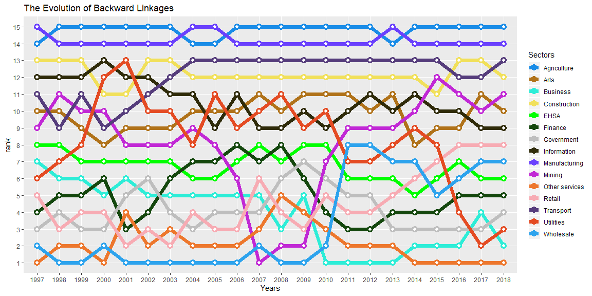
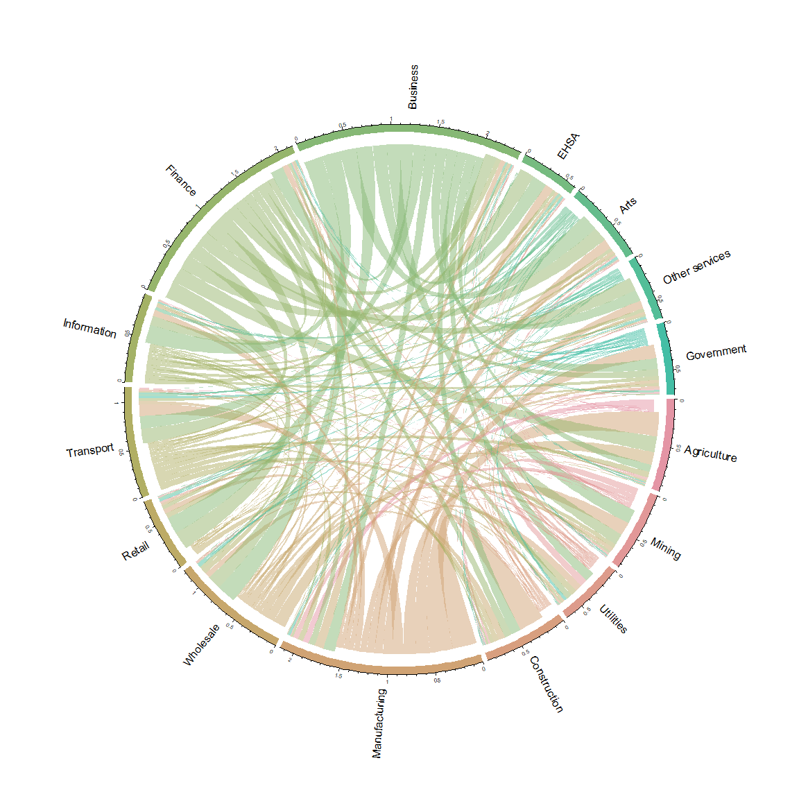

Interindustry Connectedness with SubWayPlot and Circular Plot
================
Shishir Shakya

``` r
ipack <- function(pkg){
  new.pkg <- pkg[!(pkg %in% installed.packages()[, 'Package'])]
  if (length(new.pkg)) 
    install.packages(new.pkg, dependencies = TRUE, repos = 'http://cran.us.r-project.org')
  sapply(pkg, require, character.only = TRUE)
}

ipack(c("readxl", "rstudioapi", "tidyverse", "reshape2", "circlize"))
```

    ##     readxl rstudioapi  tidyverse   reshape2   circlize 
    ##       TRUE       TRUE       TRUE       TRUE       TRUE

``` r
path <- dirname(rstudioapi::getActiveDocumentContext()$path)
setwd(path)
```

``` r
# Read the Excel Sheets
read_excel_allsheets <- function(fullpath) {
  sheets <- readxl::excel_sheets(fullpath)
  x <-    lapply(sheets, function(X) readxl::read_excel(fullpath, sheet = X))
  names(x) <- sheets
  x
}
# Especially Desigined to read 15 Sector Leontief Inverse Excel file of BEA
read.ImAI_sector <-function(mydata){
  colnames(mydata) <- mydata[5, ] # Use 4 for the shorcut name NAICS
  mydata <- mydata[6:20, -c(1,2)]
  mydata <- as.matrix(mydata)
  mydata <- apply(mydata, 2, function(x) as.numeric(x))
  colnames(mydata) <- c("Agriculture",  "Mining",   "Utilities",    "Construction", "Manufacturing",
                        "Wholesale",    "Retail",   "Transport",    
                        "Information",  "Finance",  "Business", "EHSA",
                        "Arts", "Other services",   "Government")
  rownames(mydata) <- colnames(mydata)
  mydata
}

# BEA Data Downloads 
# Total Requirements
imai_sector <- "https://apps.bea.gov/industry/xls/io-annual/IxI_TR_1997-2018_DOM_SECT.xlsx"
if (file.exists("imai_sector.xlsx") == FALSE) { #  get the zip file
  download.file(imai_sector, destfile = "imai_sector.xlsx", mode="wb")
}
imai_sector <- lapply(read_excel_allsheets("imai_sector.xlsx")[-c(1:2)], read.ImAI_sector)

nsec <- 15
## Backward Linkages 
bl <- function(listy_mat){
  z <- function(x){
    z <- colSums(x)
  }
  listy <- as.list(lapply(listy_mat, z))
  df <- as.data.frame(cbind(listy$`1997`, listy$`1998`, listy$`1999`,listy$`2000`,
                            listy$`2001`, listy$`2002`, listy$`2003`, listy$`2004`, listy$`2005`,
                            listy$`2006`, listy$`2007`, listy$`2008`, listy$`2009`, listy$`2010`,
                            listy$`2011`, listy$`2012`, listy$`2013`, listy$`2014`, listy$`2015`,
                            listy$`2016`, listy$`2017`, listy$`2018`))
  result <- outgen(df)
  return(result)
}

#Generate output with Average, SD and Trend coefficient.
#######################################
outgen <- function(val){
  id <- c(1:nsec)
  t <- 1997:2018
  val_trend <- apply(val, 1, function(x) lm(x~t)$coefficients[2])
  val_avg <- apply(val, 1, mean)
  val_sd <- apply(val, 1, sd)
  rnam <- rownames(val)
  cnam <- c("id", "Sectors", "1997",  "1998",  "1999", "2000",
            "2001",  "2002",  "2003",  "2004",  "2005",
            "2006",  "2007",  "2008",  "2009",  "2010",
            "2011",  "2012",  "2013",  "2014",  "2015", 
            "2016", "2017", "2018", "Average", "StDev",
            "Trend")
  
  PGR_Val <- cbind(id, rnam, val, val_avg, val_sd, val_trend)
  colnames(PGR_Val) <- cnam
  rownames(PGR_Val) <- NULL
  return(PGR_Val)
}
```

I am using the data from the Bureau of Economics Analysis dataset. This data set utilizes big data of all inter-industry transactions in the US. However, for the sake of simplicity, I am working on a prototype that has only 15 aggregated industry. It can easily be expanded to 420 different industry disaggregation.

This data is indeed reshaped in a wide-format; if we would develop a tidy version of this data, it can be a large size. Therefore, rather than data size, I will focus on data interpretation.

The key idea is to map the inter-industry interconnections and rank theses industry based on their interconnectedness. I will first show a simple 15 industry by 15 industry heat maps. Higher intensity of heat in this map shows a higher interconnectedness between the two sectors.

After this plot, I will show how each industry's interconnectedness rank would change over time. This temporal evolution ranking is called the subway plot. Higher the rank will represent the more connected industry. This interconnectedness is known as backward linkages in the input-output literature.


Sub Way Plot
============

``` r
bl_df <- bl(imai_sector)[1:24]
molten = reshape2::melt(bl_df, id = c("Sectors", "id"))
tops <- nsec
dftags4 <- molten %>%
  group_by(variable) %>%
  mutate(rank = row_number(value)) %>%
  ungroup() %>%
  filter(rank <= tops) %>%
  mutate(rank = factor(rank, levels = seq(tops)),
         rval = as.numeric(value))

colors <- c("Manufacturing" = "#6a40fd", "Agriculture" = "#198ce7", "Transport" = "#563d7c", "Construction" = "#f1e05a",
            "Information" = "#2f2b09", "Arts" = "#b07219", "Utilities" = "#e44b23", "EHSA" = "green",
            "Mining" = "#c128d5", "Government" = "grey", "Business" = "#2dedd7", "Finance" = "#14470d", "Other services" = "#ed772d", 
            "Retail" = "#f7abb3", "Wholesale" = "#2da3ed")

othertags <- dftags4 %>% distinct(Sectors) %>% filter(!Sectors %in% names(colors)) %>% .$Sectors

colors <- c(colors, setNames(rep("gray", length(othertags)), othertags))
library(ggplot2)
p <- ggplot(mapping = aes(variable, y = rank, group = Sectors, color = Sectors)) +
  geom_line(size = 1.7, alpha = 0.25, data = dftags4) +
  geom_line(size = 2.5, data = dftags4 %>% filter(Sectors %in% names(colors)[colors != "gray"])) +
  geom_point(size = 4, alpha = 0.25, data = dftags4) +
  geom_point(size = 4, data = dftags4 %>% filter(Sectors %in% names(colors)[colors != "gray"])) +
  geom_point(size = 1.75, color = "white", data = dftags4) +
  #geom_text(data = dftags4, aes(label = Sectors), hjust = -0, size = 4.5) +
  #geom_text(data = dftags4, aes(label = Sectors), hjust = 1, size = 4.5) +
  scale_color_manual(values = colors) +
  ggtitle("The Evolution of Backward Linkages") +
  xlab("Years") 
p
```



Interpretation
--------------

It seems that the manufacturing and agricultural sector is the most coneected industry, followed by Finance and construction industry. We can see how the mining industry is booming in US especially after 2007, in term of interconnectedness. Similar is true for Retail sector.

Circular plot
=============

Here I want to show, in terms of the flow of influence or transaction, in 2018, which sector is more influential in terms of the transaction. We can see professional business, finance, and Manufacturing have a massive flow of the transaction. This plot is exploratory, but we can indeed look at the strength of the influence, and each transaction has a mathematical interpretation.

``` r
cd <- function(df, cutval = 0, diag = c("keep", "notkeep")){
  require(circlize)
  df <- as.matrix(df)
  #df <- df + t(df)
  tidyA <- function(A, val=0.001){
    A <- as.matrix(as.data.frame(A))
    clean <- ifelse(A < 0, 0, A)
    clean <- ifelse(clean < val, 0, A)
  }
  df1 <- tidyA(df, val = cutval)
  
  if (diag == "notkeep"){
    diag(df1) <- 0
    mat <- df1
  }
  if (diag == "keep"){ 
    mat <- df1
  }
  
  grid.col <- setNames(colorspace::rainbow_hcl(length(unlist(dimnames(mat)))), union(rownames(mat), colnames(mat)))
  
  chordDiagram(mat, annotationTrack = "grid", preAllocateTracks = 1, grid.col = grid.col,
               transparency = 0.5,  
               directional = 1,
               direction.type = "diffHeight", link.sort = TRUE)
  
  circos.trackPlotRegion(track.index = 1, 
                         panel.fun = function(x, y) {
                           xlim = get.cell.meta.data("xlim")
                           ylim = get.cell.meta.data("ylim")
                           sector.name = get.cell.meta.data("sector.index")
                           circos.text(mean(xlim), ylim[1] + .1, sector.name, facing = "clockwise", niceFacing = TRUE, adj = c(0, 0.5))
                           circos.axis(h = "top", labels.cex = 0.5, major.tick.percentage = 0.2, sector.index = sector.name, track.index = 2)
                         }, bg.border = NA)
  
}
cd(df = imai_sector$`2018`, diag = "notkeep")
```


